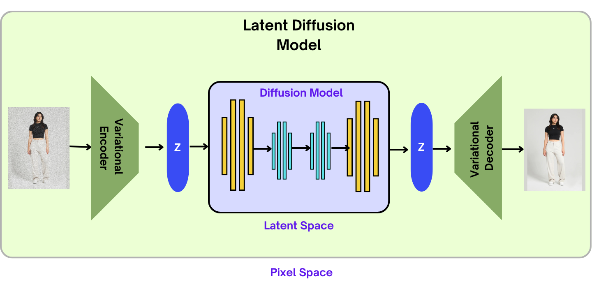

# StyleSwap AI: Advanced Virtual Try-On Solution

## Table of Contents

1. [Project Overview](#project-overview)
    - [Architecture Diagram](#architecture-diagram)
    - [Key Features](#key-features)
    - [Output Result](#output-result)
2. [Prerequisites](#prerequisites)
    - [Hardware Requirements](#hardware-requirements)
    - [Software Requirements](#software-requirements)
    - [Key Dependencies](#key-dependencies)
3. [Installation](#installation)
4. [Model Checkpoints](#model-checkpoints)
5. [Usage](#usage)
6. [Google Colab](#google-colab)
7. [Key Components](#key-components)
    - [Segment Anything Model (SAM)](#segment-anything-model-sam)
    - [Detectron2](#detectron2)
8. [Limitations and Considerations](#limitations-and-considerations)
9. [Project Video Presentation](#project-video-presentation)
10. [Contributing](#contributing)
11. [Contact](#contact)

## Project Overview

StyleSwap AI is a cutting-edge virtual try-on solution that leverages advanced AI techniques to revolutionize the online shopping experience. By allowing customers to visualize clothing items on their own images, it provides a realistic and accurate representation of fit and style.

### Architecture Diagram

[StyleSwap AI Demo](https://khiibaedu-my.sharepoint.com/:v:/g/personal/d_akbar_25363_khi_iba_edu_pk/ER5PyBJkT2tMoM8LEzpRuhkB6RdATEMvDolDa-oPBR1k8g?nav=eyJyZWZlcnJhbEluZm8iOnsicmVmZXJyYWxBcHAiOiJPbmVEcml2ZUZvckJ1c2luZXNzIiwicmVmZXJyYWxBcHBQbGF0Zm9ybSI6IldlYiIsInJlZmVycmFsTW9kZSI6InZpZXciLCJyZWZlcnJhbFZpZXciOiJNeUZpbGVzTGlua0NvcHkifX0&e=gUc5rU)

### Key Features:

-   Realistic virtual try-on using Latent Diffusion Model
-   Integration with DensePose for accurate body mapping
-   Advanced image processing with SAM (Segment Anything Model) and Detectron2
-   Reduction in return rates and improved customer satisfaction
-   Cost and time savings for clothing brands

### Output Result

## Prerequisites

### Hardware Requirements:

-   **GPU:** A dedicated GPU with at least 22 GB memory is necessary. NVIDIA GPUs are recommended for optimal performance.
-   **CPU:** High computational resources (high RAM and storage)

### Software Requirements:

-   Python 3.7 or higher
-   CUDA-compatible environment

### Key Dependencies:

-   PyTorch
-   OpenCV
-   TensorFlow
-   Detectron2
-   Segment Anything Model (SAM)
-   (Full list available in `requirements.txt`)

## Installation

1. Clone this repository:
   git clone https://github.com/DaniyalAkbar/StyleSwap-AI.git
   cd styleswap-ai

2. Install required packages:
   pip install -r requirements.txt

3. Download and place the required model checkpoints (see "Model Checkpoints" section).

## Model Checkpoints

Before running the project, download the following AI models and checkpoints and save them in their respective directories:

1. SAM Model:

-   Download from: [SAM Model Link](https://dl.fbaipublicfiles.com/segment_anything/sam_vit_h_4b8939.pth)
-   Place in: / (root location)

2. TensorFlow Files:

-   Download from: [TensorFlow Files Link](https://khiibaedu-my.sharepoint.com/:f:/g/personal/d_akbar_25363_khi_iba_edu_pk/EurmNOR4RgtLjfgnh4T19acB95XvXK1G-2yjPEk6LdtDdA?e=mJS0MT)
-   Place in: /checkpoints/

3. Latent Diffusion Model Checkpoint:

-   Download from: [LDM Checkpoint Link](https://khiibaedu-my.sharepoint.com/:f:/g/personal/d_akbar_25363_khi_iba_edu_pk/Eo8T6B9K3sNGom4g0Cf4n_MBDGldaa7t2nvl3379xs2KAA?e=WwDvaZ)
-   Place in: /ckpts/

4. OpenPose Checkpoint:

-   Download from: [OpenPose Checkpoint Link](https://khiibaedu-my.sharepoint.com/:f:/g/personal/d_akbar_25363_khi_iba_edu_pk/Et43i-FxIyFIh1sBKOqX1oQB0QiErVZIyWnn9iGznkyGTA?e=JliKI9)
-   Place in: /checkpoints/openpose/ckpts/

5. Humanparsing Checkpoint:

-   Download from: [Humanparsing Checkpoint Link](https://khiibaedu-my.sharepoint.com/:f:/g/personal/d_akbar_25363_khi_iba_edu_pk/EoiOPZi1QqxFsp-7qwGKR84BSCCK9WfE6h0eq0HKD3eUqw?e=g9QyNy)
-   Place in: /checkpoints/humanparsing/

## Usage

1. Prepare your input images (person image and clothing item image).
2. Place the images in /DATA/zalando-hd-resized/test/
3. Make sure the images are in 786 x 1024 resolution
4. Run the python script: inference.py
5. The output will be saved in the `/output/` directory.

## Google Colab

For ease of use, especially for those without access to high-performance GPUs, I have provide a Google Colab notebook. This notebook contains all the necessary code to run StyleSwap AI in sequence.

[Link to Google Colab Notebook](https://github.com/DaniyalAkbar/StyleSwap-AI/blob/main/SwapStyleAI%20COLAB.ipynb)

## Key Components

### Segment Anything Model (SAM)

SAM is a powerful image segmentation model developed by Meta AI. It provides versatile and accurate image segmentation capabilities crucial for our virtual try-on process.

Source: [Meta AI SAM](https://github.com/facebookresearch/segment-anything)

### Detectron2

Detectron2, developed by Facebook AI Research, is a state-of-the-art object detection and segmentation library. In StyleSwap AI, it's used for advanced image processing tasks, enhancing the accuracy of our virtual try-ons.

Source: [Meta AI Detectron2](https://github.com/facebookresearch/detectron2)

## Limitations and Considerations

-   High-end hardware is required for optimal performance
-   Input image quality significantly affects the output
-   Character images should have a plain background and focussed on the upper body from head to knees
-   Privacy considerations: ensure secure handling of user images

## Project Video Presentation

Link: [MS Project Presentation](https://khiibaedu-my.sharepoint.com/:v:/g/personal/d_akbar_25363_khi_iba_edu_pk/ER5PyBJkT2tMoM8LEzpRuhkB6RdATEMvDolDa-oPBR1k8g?nav=eyJyZWZlcnJhbEluZm8iOnsicmVmZXJyYWxBcHAiOiJPbmVEcml2ZUZvckJ1c2luZXNzIiwicmVmZXJyYWxBcHBQbGF0Zm9ybSI6IldlYiIsInJlZmVycmFsTW9kZSI6InZpZXciLCJyZWZlcnJhbFZpZXciOiJNeUZpbGVzTGlua0NvcHkifX0&e=gUc5rU)

## Contributing

We welcome contributions! Please see our [Contributing Guidelines](CONTRIBUTING.md) for more details.

## Contact

For any queries or support, please open an issue in this repository or contact [Email](mailto:daniyalakbar1217@gmail.com).
